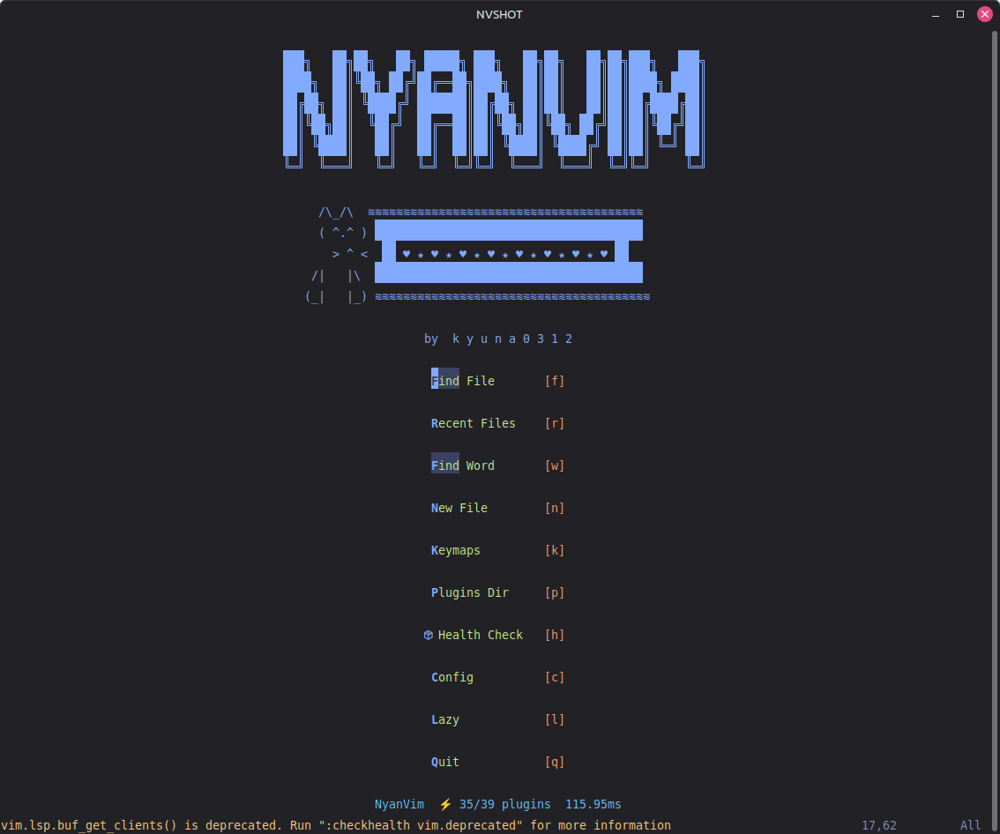
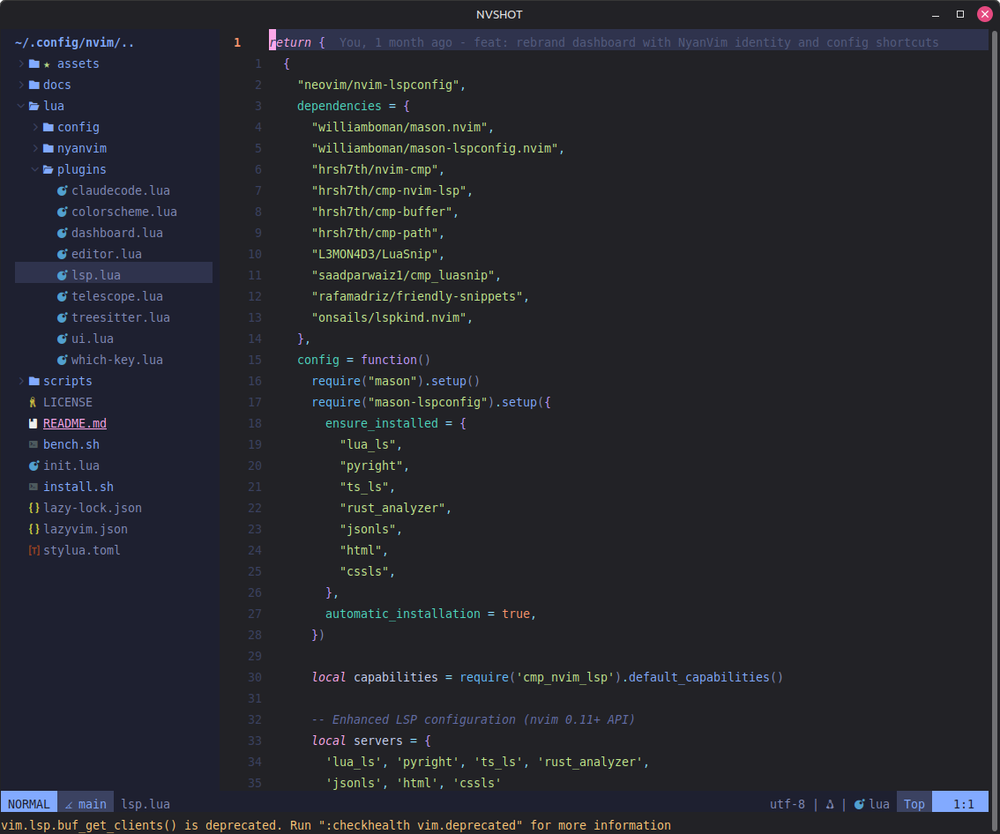
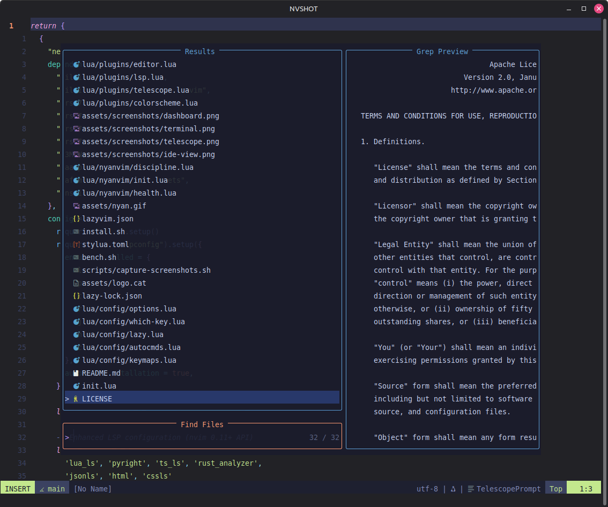
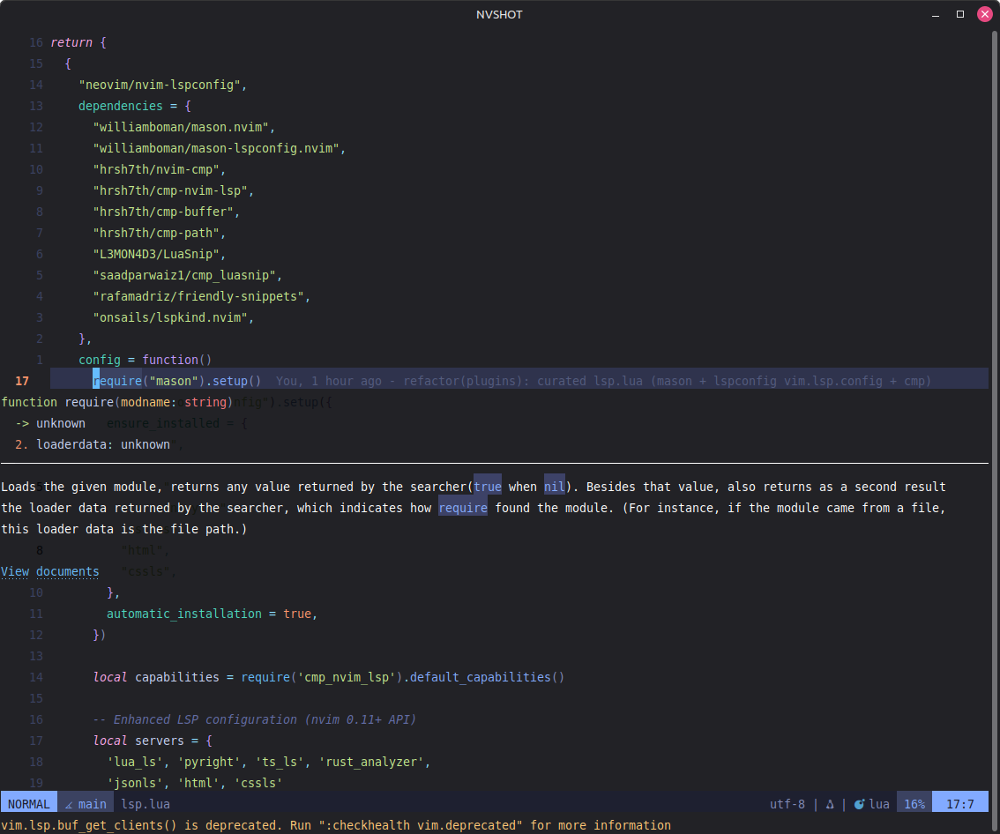
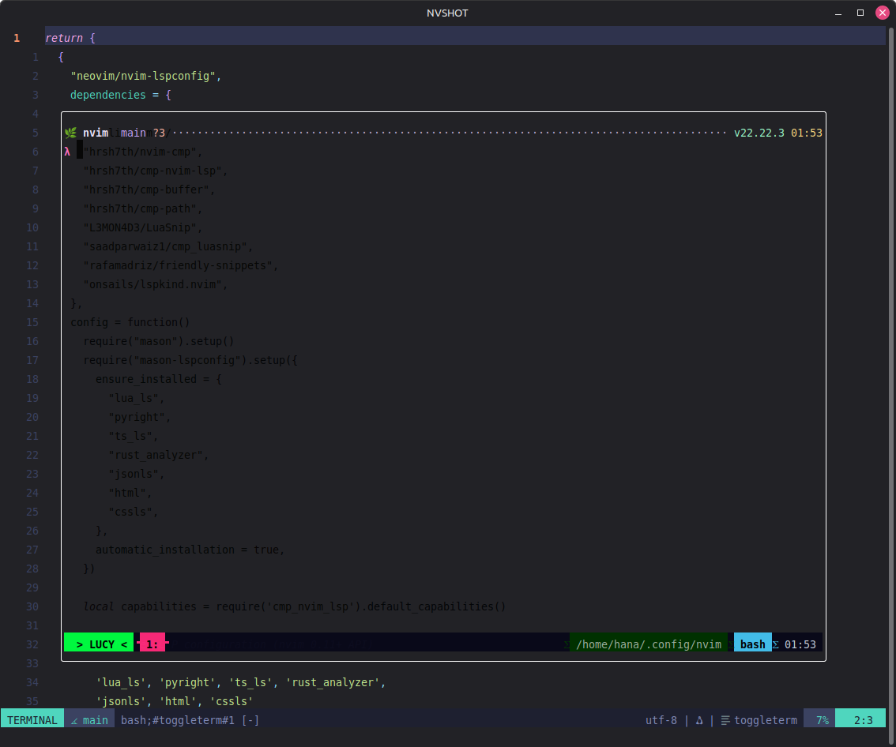

# 🐱 NyanVim

A hand-rolled Neovim config — IDE features, fast startup, VSCode-like feel — with
[Claude](https://claude.com/claude-code) built in. Organized
[craftzdog](https://github.com/craftzdog/dotfiles-public)-style: a thin
[lazy.nvim](https://github.com/folke/lazy.nvim) loader and one plugin per file.

<div align="center">
  
</div>

<div align="center">



</div>

## Showcase

| IDE View | Fuzzy Finder |
|----------|-------------|
|  |  |

| LSP Hover | Terminal |
|-----------|----------|
|  |  |

## Features

- **Claude in the editor** — [`coder/claudecode.nvim`](https://github.com/coder/claudecode.nvim): run the Claude Code CLI in a split, send selections/buffers, apply diffs. No API key.
- **LSP** — mason + nvim-lspconfig on the modern `vim.lsp.config`/`vim.lsp.enable` API (Neovim 0.11+). 8 servers auto-installed.
- **Completion** — nvim-cmp + LuaSnip + lspkind.
- **Fuzzy finding** — Telescope (fzf-native, ui-select, projects, neoclip).
- **Syntax** — Treesitter (highlight + indent).
- **UI** — NyanVim dashboard, lualine, bufferline, nvim-tree, indent guides, illuminate.
- **Git** — gitsigns, diffview, lazygit.
- **Editor** — toggleterm, autopairs, Comment.nvim, todo-comments, project.nvim.
- **Keymap discovery** — which-key (v3).
- **Themes** — tokyonight-moon (default) + solarized-osaka (`:colorscheme solarized-osaka`).
- **Discipline** — habit-trainer that nags on `hjkl`/arrow spamming.

## Requirements

| Dependency | Version | Notes |
|-----------|---------|-------|
| Neovim | **>= 0.11** | required — Telescope and `vim.lsp.enable` need it. [Install](https://neovim.io) |
| Git | >= 2.19 | |
| Node.js | any LTS | for LSP servers |
| ripgrep | any | `rg` — Telescope grep |
| fd | any | `fd` — Telescope find |
| C compiler | any | `gcc`/`clang` — Treesitter |
| Nerd Font | any | [nerdfonts.com](https://www.nerdfonts.com/) |
| Claude Code CLI | any | optional — for in-editor Claude (`claude` on PATH) |

> **Note:** Distro packages are often too old (e.g. Ubuntu ships 0.9.x). Use the
> official AppImage or a recent build to get **0.11+**.

## Install

```bash
curl -fsSL https://raw.githubusercontent.com/kyuna0312/NyanVim/main/install.sh | bash
```

Or manually:

```bash
# Back up existing config
mv ~/.config/nvim ~/.config/nvim.bak

# Clone
git clone https://github.com/kyuna0312/NyanVim.git ~/.config/nvim

# Start Neovim — plugins install automatically on first launch
nvim
```

After install, run `:checkhealth nyanvim` to verify your system is set up correctly.

## Key Keymaps

Leader key: **`<Space>`**

### Navigation
| Key | Action |
|-----|--------|
| `<Space>ff` | Find files |
| `<Space>fg` | Live grep |
| `<Space>fb` | Open buffers |
| `<Space>fh` | Help tags |
| `<C-b>` | Toggle file explorer (nvim-tree) |
| `<Space>e` | Toggle file explorer |
| `<S-h>` / `<S-l>` | Prev / Next buffer |
| `<C-h/j/k/l>` | Navigate windows |

### LSP
| Key | Action |
|-----|--------|
| `gd` | Go to definition |
| `gD` | Go to declaration |
| `gr` | References |
| `gi` | Implementation |
| `K` | Hover docs |
| `<Space>rn` | Rename symbol |
| `<Space>ca` | Code actions |
| `<Space>f` | Format buffer |

### AI / Claude
| Key | Action |
|-----|--------|
| `<Space>ac` | Toggle Claude split |
| `<Space>af` | Focus Claude |
| `<Space>as` | Send visual selection (visual mode) |
| `<Space>ab` | Add current buffer to context |
| `<Space>at` | Add file from tree |
| `<Space>aa` / `<Space>ad` | Accept / Deny diff |
| `<Space>ar` / `<Space>aC` | Resume / Continue session |
| `<Space>am` | Select model |

### Tools
| Key | Action |
|-----|--------|
| `<Space>t` | Toggle terminal |
| `<C-\>` | Toggle floating terminal |
| `:Mason` | LSP/tool installer |
| `:LazyGit` | Git UI |
| `:Dashboard` | NyanVim dashboard |

Press `<Space>` and wait to browse all groups via which-key.

## Structure

```
init.lua                 -- leader, options, then loads config + discipline
lua/
  config/
    lazy.lua             -- bootstrap + { import = "plugins" }
    options.lua          -- editor options
    keymaps.lua          -- direct keymaps
    autocmds.lua         -- autocommands
    which-key.lua        -- <leader> group definitions
  plugins/               -- one concern per file, all auto-imported
    colorscheme · ui · dashboard · telescope · lsp
    treesitter · editor · which-key · claudecode
  nyanvim/
    init.lua · health.lua · discipline.lua
```

## Customize

Add a file under `lua/plugins/` returning a lazy.nvim spec — it's picked up
automatically by `{ import = "plugins" }`:

```lua
-- lua/plugins/my-plugin.lua
return {
  { "owner/repo", opts = {} },
}
```

## Update

```bash
cd ~/.config/nvim
git pull
nvim --headless "+Lazy! sync" +qa
```

## Languages Included

LSP servers auto-installed via mason: **Lua · Python · TypeScript/JavaScript ·
Rust · JSON · HTML · CSS**. Treesitter additionally parses Go, Bash, Markdown,
Vim, and more.

## Troubleshoot

```
:checkhealth nyanvim
```

## Performance

Startup time is benchmarked on every release using `nvim --startuptime`.

Results live in [`docs/perf/`](docs/perf/) — one file per release, with mean/median/min/max and a comparison against the previous release.

**Run locally:**
```bash
./bench.sh --runs 10
```

Results are saved to `docs/perf/YYYY-MM-DD-VERSION.md`.
